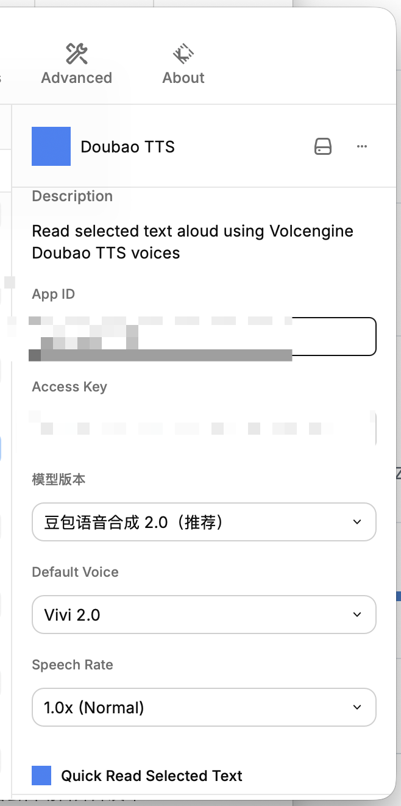
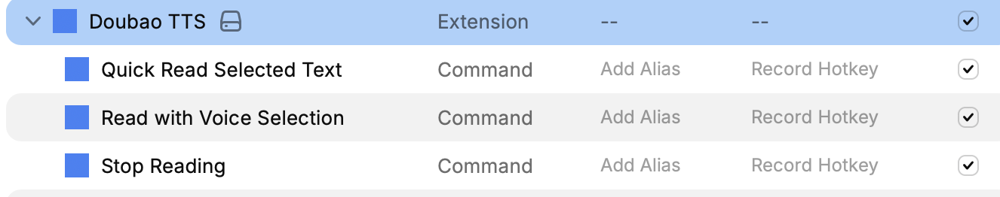
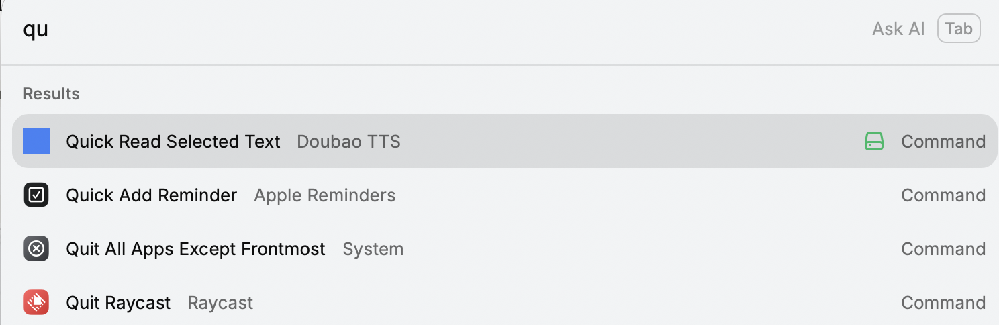

# Doubao TTS — Raycast Extension

<p align="center">
  
</p>

<p align="center">
  Select any text on macOS, read it aloud via <a href="https://www.raycast.com/">Raycast</a> — powered by <a href="https://www.volcengine.com/docs/6561/1598757">Volcengine Doubao TTS V3</a>.<br/>
  在 macOS 上选中任意文字，通过 <a href="https://www.raycast.com/">Raycast</a> 一键朗读 — 基于<a href="https://www.volcengine.com/docs/6561/1598757">火山引擎豆包语音合成大模型 V3</a>。
</p>

---

## Why Doubao TTS? | 为什么选择豆包 TTS？

**Doubao TTS is the leading Chinese AI speech synthesis engine.** It delivers unmatched naturalness, emotional expression, and voice diversity for Chinese text. Whether you're listening to research papers, long articles, or everyday text, Doubao TTS provides near-human-quality speech — no extra apps required.

**豆包语音合成（Doubao TTS）是目前中文 AI 语音合成领域的标杆产品。** 在中文 TTS 的自然度、情感表达和音色丰富度上，豆包稳居第一梯队，远超传统 TTS 引擎。本扩展通过直接调用 V3 HTTP API，让你在 Raycast 中即可使用顶级中文 TTS —— 无需安装任何额外应用。

### Who is this for? | 适用人群

- **Researchers** — Listen to papers and documents, free your eyes | 科研工作者 — 朗读论文、文档，解放双眼
- **Developers** — Review docs, READMEs, and comments by ear | 开发者 / 码农 — 听取技术文档，换个方式审阅
- **Language learners** — Hear standard Chinese pronunciation | 语言学习者 — 听取标准中文发音
- **Content creators** — Preview how your text sounds | 内容创作者 — 快速预览文本的语音效果
- **Anyone who needs TTS** — Select text, press a key, listen | 任何有 TTS 需求的人 — 选中文字，一键朗读

## Features | 功能特性

- **Quick Read** — Select text, read aloud instantly (no UI) | 选中文字，一键朗读
- **Voice Selection** — Browse 90+ voices organized by category | 从 90+ 音色中选择
- **Stop Reading** — Stop playback anytime | 随时停止播放
- **Toggle mode** — Trigger Quick Read again to stop | 再次触发即可停止
- **Smart chunking** — Auto-split long text by sentence | 自动按句子拆分长文本
- **Model switching** — TTS 2.0 (recommended) and TTS 1.0 | 支持 2.0 和 1.0 模型
- **Chinese & English** — Built-in voices for both languages | 内置中英文音色

## Screenshots | 截图

| Quick Read 快速朗读 | Hotkey Binding 快捷键绑定 | Preferences 偏好设置 |
|:---:|:---:|:---:|
|  |  |  |

## Installation | 安装

### Prerequisites | 前置要求

- [Raycast](https://www.raycast.com/) installed | 已安装
- A Volcengine account with **Doubao TTS** enabled ([guide below](#get-app-id--access-key--获取-app-id-和-access-key)) | 火山引擎账号，已开通豆包语音合成服务

### Steps | 安装步骤

```bash
# 1. Clone the repo | 克隆仓库
git clone https://github.com/xwzhangSZU/raycast-doubao-tts.git
cd raycast-doubao-tts

# 2. Install dependencies | 安装依赖
npm install

# 3. Start dev mode (auto-loads into Raycast) | 启动开发模式
npm run dev
```

Search "Doubao" in Raycast to find the commands. | 在 Raycast 中搜索 "Doubao" 即可看到命令。

## Configuration | 配置

Raycast will prompt for preferences on first use. | 首次使用时，Raycast 会自动弹出偏好设置页面。

| Setting 配置项 | Description 说明 | Required 必填 |
|--------|------|:----:|
| **App ID** | Volcengine app identifier 火山引擎应用标识 | ✅ |
| **Access Key** | Volcengine access key 火山引擎访问密钥 | ✅ |
| Model Version | TTS model (default: 2.0) 语音合成模型 | |
| Default Voice | Voice for Quick Read 默认音色 | |
| Speech Rate | Playback speed (0.5x–2.0x) 语速 | |

### Get App ID & Access Key | 获取 App ID 和 Access Key

1. Sign up and log in to [Volcengine Console](https://console.volcengine.com/) | 注册并登录火山引擎控制台
2. Go to [Speech → Doubao TTS](https://console.volcengine.com/speech/service/10007) | 进入语音技术 → 豆包语音合成
3. Enable the service if not already active | 如尚未开通，点击「开通服务」
4. Find your credentials | 在控制台页面获取：
   - **App ID** = `X-Api-App-Id`
   - **Access Key** (Access Token) = `X-Api-Access-Key`
5. See also: [Console FAQ](https://www.volcengine.com/docs/6561/196768) | [控制台使用 FAQ](https://www.volcengine.com/docs/6561/196768)

> **Tip**: New Volcengine users get a free quota. Check the console for details. | 火山引擎新用户有免费额度，具体以控制台显示为准。

### Model Versions | 模型版本

| Model 模型版本 | Resource ID | Description 说明 |
|----------|-------------|------|
| Doubao TTS 2.0 (Recommended) | `seed-tts-2.0` | Latest model, best quality 最新模型 |
| Doubao TTS 1.0 | `seed-tts-1.0` | Classic model, more voices 经典模型 |
| Doubao TTS 1.0 (High Concurrency) | `seed-tts-1.0-concurr` | Higher concurrency 更高并发 |
| Voice Clone 2.0 | `seed-icl-2.0` | Voice cloning 声音克隆 |
| Voice Clone 1.0 | `seed-icl-1.0` | Voice cloning 声音克隆 |

> **Note**: Different models support different voices. TTS 2.0 shows only 2.0 voices; TTS 1.0 shows only 1.0 voices. | 不同模型版本支持不同音色。

### Voice List | 音色列表

90+ built-in voices organized by category | 扩展内置 90+ 音色，按分类组织：

| Category 分类 | Examples 示例 | Model 模型 |
|------|----------|----------|
| General Female 通用女声 | Vivi, Xiaohe, Cancan | 1.0 / 2.0 |
| General Male 通用男声 | Yunzhou, Xiaotian, Qingcang | 1.0 / 2.0 |
| Emotional Female 多情感女声 | Emotional Cancan, Sweet Female | 1.0 |
| Emotional Male 多情感男声 | Emotional Male | 1.0 |
| English 英文音色 | Tim, Adam, Amanda | 1.0 / 2.0 |
| Japanese / Korean / Multilingual | Japanese Female, Korean Female | 1.0 / 2.0 |
| Fun Accents / Role Play 趣味口音 | Dongbei Bro, Beijing Accent | 1.0 |

Full voice list: [Doubao Voice Catalog](https://www.volcengine.com/docs/6561/1257544) | 完整音色列表：[豆包大模型音色列表](https://www.volcengine.com/docs/6561/1257544)

## Usage | 使用方法

### Quick Read (Recommended | 推荐)

1. Select text in any app | 在任意应用中选中文字
2. Open Raycast (`⌥ Space`) | 打开 Raycast
3. Type `Quick Read` and press Enter | 输入 `Quick Read` 并回车
4. It reads aloud! Trigger again to stop | 开始朗读！再次触发停止

### Bind a Hotkey (Highly Recommended) | 绑定快捷键（强烈推荐）

Bind a global hotkey to Quick Read for the ultimate workflow: **select text → press hotkey → instant reading**, no need to open Raycast every time.

为 Quick Read 绑定全局快捷键，实现 **选中文字 → 按快捷键 → 自动朗读** 的极简体验：

1. Open Raycast → search `Extensions` | 打开 Raycast → 搜索 `Extensions`
2. Find **Doubao TTS** | 找到 Doubao TTS 扩展
3. Click `Record Hotkey` next to **Quick Read Selected Text** | 点击 `Record Hotkey`
4. Press your desired key combo (e.g. `⌥ R`, `⌃ ⌥ S`) | 按下你想要的快捷键组合
5. Done! Select text anywhere and press the hotkey to read | 完成！此后选中文字按快捷键即可朗读

> **Tip**: You can also bind a hotkey to Stop Reading for quick stopping. | 也可以为 Stop Reading 绑定快捷键。

### Read with Voice Selection | 选择音色朗读

1. Select text | 选中文字
2. Open `Read with Voice Selection` in Raycast | 在 Raycast 中打开
3. Browse voices, pick one | 浏览音色列表
4. Press Enter to start | 按回车开始朗读

### Stop Reading | 停止播放

- Run `Stop Reading` in Raycast | 执行 `Stop Reading` 命令
- Or trigger Quick Read again while playing | 或播放时再次触发 Quick Read

## Development | 开发

### Project Structure | 项目结构

```
raycast-doubao-tts/
├── src/
│   ├── api/
│   │   ├── volcengine-tts.ts   # V3 API client | API 客户端
│   │   └── types.ts            # TypeScript types | 类型定义
│   ├── constants/
│   │   └── voices.ts           # 90+ voice configs | 音色配置
│   ├── utils/
│   │   ├── audio-player.ts     # Audio player (afplay) | 播放器
│   │   └── text-chunker.ts     # Smart text chunking | 文本分片
│   ├── quick-read.tsx          # Quick Read command
│   ├── read-with-voice.tsx     # Voice selection command
│   └── stop-reading.tsx        # Stop playback command
├── assets/
│   └── icon.png                # Extension icon
├── package.json
└── tsconfig.json
```

### Local Development | 本地开发

```bash
npm install    # Install dependencies | 安装依赖
npm run dev    # Dev mode (hot reload) | 开发模式
npm run build  # Build | 构建
npm run lint   # Lint | 代码检查
```

### Technical Details | 技术细节

- **API**: Volcengine Doubao TTS V3 HTTP unidirectional streaming | 火山引擎豆包 TTS V3 HTTP 流式接口
- **Auth**: HTTP Headers (`X-Api-App-Id`, `X-Api-Access-Key`, `X-Api-Resource-Id`)
- **Response**: JSON Lines (NDJSON), one JSON object per line
- **Audio**: MP3, 24000 Hz
- **Chunking**: Smart split by punctuation, ≤1024 UTF-8 bytes per chunk | 按标点拆分
- **Playback**: macOS built-in `afplay`
- **Cross-command stop**: PID file (`$TMPDIR/doubao-tts.pid`)

## References | 相关文档

- [Raycast Extension Docs](https://developers.raycast.com/)
- [Doubao TTS V3 HTTP API](https://www.volcengine.com/docs/6561/1598757) | 豆包语音合成大模型 V3
- [Doubao Voice Catalog](https://www.volcengine.com/docs/6561/1257544) | 豆包大模型音色列表
- [Volcengine Console FAQ](https://www.volcengine.com/docs/6561/196768) | 火山引擎控制台 FAQ

## Acknowledgements | 致谢

- [Bob Plugin - Doubao TTS](https://github.com/Littlecowherd/bob-plugin-doubao-tts) — Inspired the configuration approach | 本项目参考了其配置方案
- [Volcengine](https://www.volcengine.com/) — Doubao TTS API provider | 提供豆包语音合成 API

## License | 许可证

[MIT](LICENSE)
