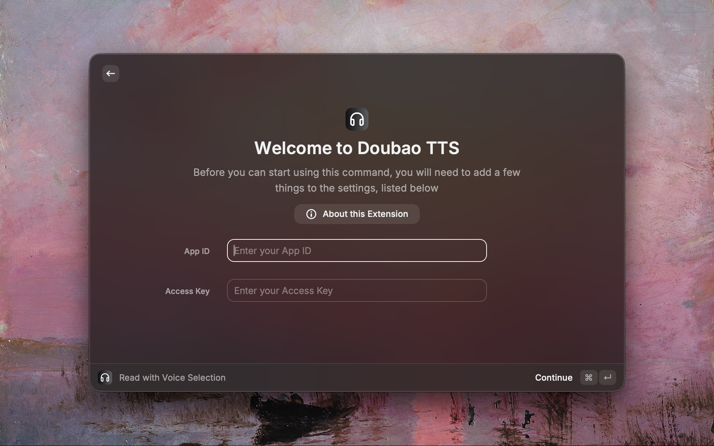

# Doubao TTS — Raycast 扩展

<p align="center">
  
</p>

<p align="center">
  在 macOS 上选中任意文字，通过 <a href="https://www.raycast.com/">Raycast</a> 一键朗读 — 基于<a href="https://www.volcengine.com/docs/6561/1598757">火山引擎豆包语音合成大模型 V3</a>。
</p>

---

## 为什么选择豆包 TTS？

**豆包语音合成（Doubao TTS）是目前中文 AI 语音合成领域的标杆产品。** 在中文 TTS 的自然度、情感表达和音色丰富度上，豆包稳居第一梯队，远超传统 TTS 引擎。本扩展通过直接调用 V3 HTTP API，让你在 Raycast 中即可使用顶级中文 TTS —— 无需安装任何额外应用。

### 适用人群

- **科研工作者** — 朗读论文、文档，解放双眼
- **开发者 / 码农** — 听取技术文档，换个方式审阅
- **语言学习者** — 听取标准中文发音
- **内容创作者** — 快速预览文本的语音效果
- **任何有 TTS 需求的人** — 选中文字，一键朗读

## 功能特性

- **一键朗读** — 选中文字，即刻朗读
- **音色选择** — 从 90+ 音色中选择
- **停止播放** — 随时停止播放
- **切换模式** — 再次触发即可停止
- **智能分片** — 自动按句子拆分长文本
- **模型切换** — 支持 2.0 和 1.0 模型
- **中英文支持** — 内置中英文音色

## 截图



## 安装

### 前置要求

- [Raycast](https://www.raycast.com/) 已安装
- 火山引擎账号，已开通豆包语音合成服务

### 安装步骤

1. 在 Raycast 应用商店中搜索 **"Doubao TTS"**，下载安装
2. 首次启动时配置 App ID 和 Access Key
3. 为 Quick Read 绑定快捷键
4. 选中文字，按下快捷键，即刻朗读！

## 配置

Raycast 会在首次使用时自动弹出偏好设置页面。

| 配置项         | 说明                      | 必填 |
| -------------- | ------------------------- | :--: |
| **App ID**     | 火山引擎应用标识          |  ✅  |
| **Access Key** | 火山引擎访问密钥          |  ✅  |
| Model Version  | 语音合成模型（默认：2.0） |      |
| Default Voice  | 默认音色                  |      |
| Speech Rate    | 语速（0.5x–2.0x）         |      |

### 获取 App ID 和 Access Key

1. 注册并登录[火山引擎控制台](https://console.volcengine.com/)
2. 进入语音技术 → 豆包语音合成
3. 如尚未开通，点击「开通服务」
4. 在控制台页面获取：
   - **App ID** = `X-Api-App-Id`
   - **Access Key** (Access Token) = `X-Api-Access-Key`
5. 详见：[控制台使用 FAQ](https://www.volcengine.com/docs/6561/196768)

> **提示**：火山引擎新用户有免费额度，具体以控制台显示为准。

### 模型版本

| 模型版本                | Resource ID            | 说明     |
| ----------------------- | ---------------------- | -------- |
| Doubao TTS 2.0 (推荐)   | `seed-tts-2.0`         | 最新模型 |
| Doubao TTS 1.0          | `seed-tts-1.0`         | 经典模型 |
| Doubao TTS 1.0 (高并发) | `seed-tts-1.0-concurr` | 更高并发 |
| Voice Clone 2.0         | `seed-icl-2.0`         | 声音克隆 |
| Voice Clone 1.0         | `seed-icl-1.0`         | 声音克隆 |

> **注意**：不同模型版本支持不同音色。

### 音色列表

扩展内置 90+ 音色，按分类组织：

| 分类                 | 示例               | 模型      |
| -------------------- | ------------------ | --------- |
| 通用女声             | Vivi, 小何, 灿灿   | 1.0 / 2.0 |
| 通用男声             | 云舟, 小天, 擎苍   | 1.0 / 2.0 |
| 多情感女声           | 情感灿灿, 甜美女生 | 1.0       |
| 多情感男声           | 情感男声           | 1.0       |
| 英文音色             | Tim, Adam, Amanda  | 1.0 / 2.0 |
| 日语 / 韩语 / 多语言 | 日语女声, 韩语女声 | 1.0 / 2.0 |
| 趣味口音             | 东北老铁, 北京腔   | 1.0       |

完整音色列表：[豆包大模型音色列表](https://www.volcengine.com/docs/6561/1257544)

## 使用方法

### 快速朗读（推荐）

1. 在任意应用中选中文字
2. 打开 Raycast（`⌥ Space`）
3. 输入 `Quick Read` 并回车
4. 开始朗读！再次触发停止

### 绑定快捷键（强烈推荐）

为 Quick Read 绑定全局快捷键，实现 **选中文字 → 按快捷键 → 自动朗读** 的极简体验：

1. 打开 Raycast → 搜索 `Extensions`
2. 找到 Doubao TTS 扩展
3. 点击 `Record Hotkey`
4. 按下你想要的快捷键组合（如 `⌥ R`, `⌃ ⌥ S`）
5. 完成！此后选中文字按快捷键即可朗读

> **提示**：也可以为 Stop Reading 绑定快捷键。

### 选择音色朗读

1. 选中文字
2. 在 Raycast 中打开 `Read with Voice Selection`
3. 浏览音色列表
4. 按回车开始朗读

### 停止播放

- 执行 `Stop Reading` 命令
- 或播放时再次触发 Quick Read

## 开发

### 项目结构

```
raycast-doubao-tts/
├── src/
│   ├── api/
│   │   ├── volcengine-tts.ts   # API 客户端
│   │   └── types.ts            # 类型定义
│   ├── constants/
│   │   └── voices.ts           # 90+ 音色配置
│   ├── utils/
│   │   ├── audio-player.ts     # 播放器（afplay）
│   │   └── text-chunker.ts     # 文本分片
│   ├── quick-read.tsx          # Quick Read 命令
│   ├── read-with-voice.tsx     # 音色选择命令
│   └── stop-reading.tsx        # 停止播放命令
├── assets/
│   └── command-icon.png        # 扩展图标
├── package.json
└── tsconfig.json
```

### 本地开发

```bash
npm install    # 安装依赖
npm run dev    # 开发模式
npm run build  # 构建
npm run lint   # 代码检查
```

### 技术细节

- **API**：火山引擎豆包 TTS V3 HTTP 流式接口
- **认证**：HTTP 请求头（`X-Api-App-Id`, `X-Api-Access-Key`, `X-Api-Resource-Id`）
- **响应**：JSON Lines（NDJSON），每行一个 JSON 对象
- **音频**：MP3，24000 Hz
- **分片**：按标点拆分，每片 ≤1024 UTF-8 字节
- **播放**：macOS 内置 `afplay`
- **跨命令停止**：PID 文件（`$TMPDIR/doubao-tts.pid`）

## 相关文档

- [Raycast 扩展文档](https://developers.raycast.com/)
- [豆包语音合成大模型 V3](https://www.volcengine.com/docs/6561/1598757)
- [豆包大模型音色列表](https://www.volcengine.com/docs/6561/1257544)
- [火山引擎控制台 FAQ](https://www.volcengine.com/docs/6561/196768)

## 致谢

- [Bob Plugin - Doubao TTS](https://github.com/Littlecowherd/bob-plugin-doubao-tts) — 本项目参考了其配置方案
- [Volcengine](https://www.volcengine.com/) — 提供豆包语音合成 API

## 许可证

[MIT](LICENSE)
